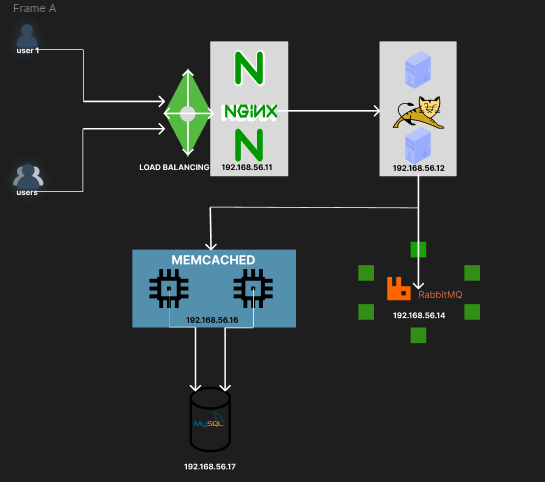

# Automatic Vagrant Setup for Local Environment

This project provides an automated Vagrant configuration to set up a local development environment with multiple virtual machines (VMs) for various services. The setup includes provisioning scripts to configure each VM automatically.

## Prerequisites

Before using this setup, ensure you have the following installed on your system:

- [Vagrant](https://www.vagrantup.com/downloads)
- [VirtualBox](https://www.virtualbox.org/)
- [Vagrant Hostmanager Plugin](https://github.com/devopsgroup-io/vagrant-hostmanager)

To install the Hostmanager plugin, run:

```sh
vagrant plugin install vagrant-hostmanager
```

## VMs Configuration

The Vagrantfile defines the following VMs:

### Nginx VM (web01)
- **Box**: ubuntu/jammy64  
- **IP Address**: 192.168.56.11  
- **Memory**: 800 MB  
- **Purpose**: Acts as a web server.  
- **Provisioning Script**: `nginx.sh`  

### Tomcat VM (app01)
- **Box**: eurolinux-vagrant/centos-stream-9  
- **IP Address**: 192.168.56.12  
- **Memory**: 800 MB  
- **Purpose**: Hosts the application server.  
- **Provisioning Script**: `tomcat.sh`  

### RabbitMQ VM (rmq01)
- **Box**: eurolinux-vagrant/centos-stream-9  
- **IP Address**: 192.168.56.16  
- **Memory**: 600 MB  
- **Purpose**: Message broker.  
- **Provisioning Script**: `rabbitmq.sh`  

### Memcache VM (mc01)
- **Box**: eurolinux-vagrant/centos-stream-9  
- **IP Address**: 192.168.56.14  
- **Memory**: 600 MB  
- **Purpose**: Caching layer.  
- **Provisioning Script**: `memcache.sh`  

### Database VM (db01)
- **Box**: eurolinux-vagrant/centos-stream-9  
- **IP Address**: 192.168.56.15  
- **Memory**: 600 MB  
- **Purpose**: Database server.  
- **Provisioning Script**: `mysql.sh`  

## Usage

1. Clone this repository or navigate to the directory containing the Vagrantfile.
2. Start the VMs by running:
   ```sh
   vagrant up
   ```
3. Access individual VMs using:
   ```sh
   vagrant ssh <vm_name>
   ```
   Replace `<vm_name>` with the name of the VM (e.g., web01, app01, etc.).
4. To stop the VMs, run:
   ```sh
   vagrant halt
   ```
5. To destroy the VMs, run:
   ```sh
   vagrant destroy
   ```

## Provisioning Scripts

Each VM is provisioned using a shell script to automate its setup:

- **`nginx.sh`**: Installs and configures Nginx as a web server.
- **`tomcat.sh`**: Installs and configures Tomcat as an application server.
- **`rabbitmq.sh`**: Installs and configures RabbitMQ as a message broker.
- **`memcache.sh`**: Installs and configures Memcached as a caching layer.
- **`mysql.sh`**: Installs and configures MariaDB as a database server, including database initialization.

## Network Configuration

Each VM is configured with a private network and a static IP address. Ensure that the IP range `192.168.56.x` does not conflict with other networks on your system.

## Notes

- The Vagrantfile uses the Hostmanager plugin to manage hosts entries for the VMs. Ensure the plugin is installed before running `vagrant up`.
- You can customize the VM configurations (e.g., memory, IP addresses) by editing the Vagrantfile.

## Troubleshooting

- If you encounter issues with the Hostmanager plugin, try running `vagrant up` with elevated privileges (e.g., `sudo`).
- Ensure VirtualBox is installed and properly configured on your system.



## License

This project is licensed under the MIT License. See the LICENSE file for details.
