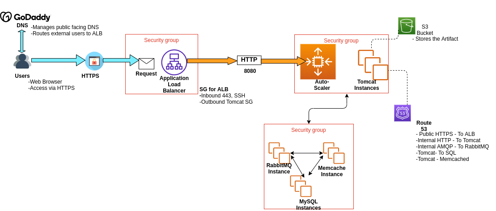

# AWS Lift and Shift Project

This project demonstrates a simple **lift-and-shift** migration of an application from a virtual machine to AWS. The application is a web-based system built using Java (Spring MVC) and JSP, with a Bootstrap-based frontend.

## Project Structure

- **src/main/webapp**: Contains the web application files, including JSP views, CSS, and JavaScript resources.
- **src/test/java**: Includes unit tests for the application.
- **src/main/java**: Contains the Java source code for controllers, services, and models.

## Key Features

- **Lift-and-Shift**: The application is migrated as-is from a virtual machine to AWS without any architectural changes.
- **Spring MVC Framework**: Backend logic is implemented using Spring MVC.
- **Bootstrap Frontend**: The UI is styled using Bootstrap for responsiveness.
- **MockMVC Testing**: Unit tests are implemented for controllers using MockMVC.

## Steps to Deploy

1. **Prepare the Virtual Machine**:
   - Ensure the application is running correctly on the virtual machine.
   - Package the application as a WAR file.

2. **Set Up AWS Environment**:
   - Launch an EC2 instance with a compatible operating system.
   - Install a web server (e.g., Apache Tomcat) on the EC2 instance.

3. **Deploy the Application**:
   - Transfer the WAR file to the EC2 instance.
   - Deploy the WAR file to the web server (e.g., place it in the `webapps` directory of Tomcat).

4. **Access the Application**:
   - Open the application in a browser using the public IP or domain of the EC2 instance.

## Testing

- Unit tests for the application can be run using JUnit.
- MockMVC is used to test the controllers and ensure the endpoints return the expected views and statuses.

## Notes

- This project is a direct migration without refactoring or optimization for cloud-native architecture.
- Future enhancements could include containerization (e.g., Docker) or leveraging AWS services like RDS, S3, and Elastic Beanstalk.

## Contact

For any questions or issues, please contact the VisualPath team at:
- **Email**: chrispineouda@gmail.com
- **Phone**: +254114173968

