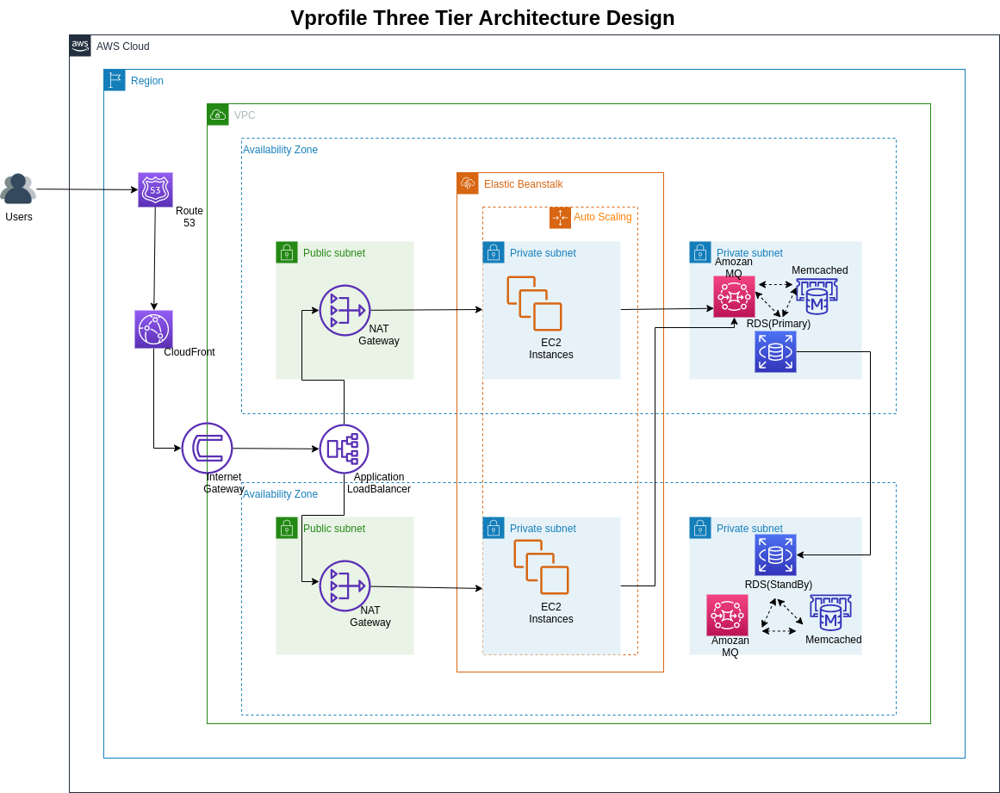

# Re-Architecting the System in AWS

This project demonstrates the **re-architecture** of a monolithic application into a more modular and scalable system in AWS. The application is restructured to leverage AWS services and best practices for high availability, scalability, and maintainability.

## Key Features

- **Modular Architecture**: The system is divided into separate components for backend services, application deployment, and database management.
- **AWS Integration**: The application is deployed on AWS EC2 instances with services like Memcached, RabbitMQ, and MariaDB configured for scalability.
- **Spring Framework**: The backend is implemented using Spring MVC with configurations for RabbitMQ, security, and database integration.
- **Automation**: User data scripts are used to automate the setup of application components.

## Project Structure

- **userdata/tomcat.sh**: Automates the setup of Apache Tomcat, deployment of the application, and configuration of the application server.
- **userdata/backend.sh**: Automates the setup of backend services like Memcached, RabbitMQ, and MariaDB.
- **src/main/webapp/WEB-INF**: Contains configuration files for the Spring application, including `web.xml` and `appconfig-root.xml`.

## Steps to Deploy

### 1. Backend Setup
- Use the `userdata/backend.sh` script to set up:
  - **Memcached**: For caching.
  - **RabbitMQ**: For messaging.
  - **MariaDB**: For database management, including restoring the application database.

### 2. Application Server Setup
- Use the `userdata/tomcat.sh` script to:
  - Install and configure Apache Tomcat.
  - Deploy the application WAR file.
  - Configure the application properties.

### 3. Application Configuration
- The application is configured using Spring's XML-based configuration files:
  - `appconfig-root.xml`: Central configuration file importing other configurations.
  - `application.properties`: Contains environment-specific properties.

### 4. Access the Application
- Once the setup is complete, access the application using the public IP or domain of the EC2 instance hosting the Tomcat server.

## Technologies Used

- **Spring Framework**: For backend logic and dependency injection.
- **Apache Tomcat**: For application deployment.
- **Memcached**: For caching.
- **RabbitMQ**: For messaging.
- **MariaDB**: For database management.

## Notes

- This re-architecture focuses on modularizing the system for better scalability and maintainability.
- Future enhancements could include containerization (e.g., Docker) or using AWS managed services like RDS, ElastiCache, and SQS.

## Contact

- **Email**: chrispineouda@gmail.com
- **Phone**: +254114173968

