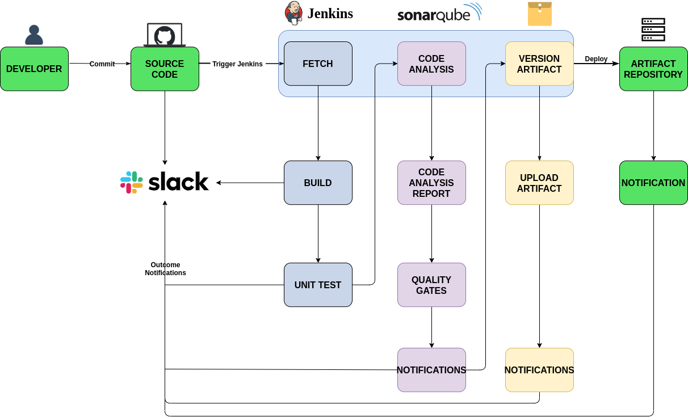

# CI/CD Pipeline Setup

This project demonstrates the setup of a **CI/CD pipeline** using tools like SonarQube, Nexus, and Jenkins. The pipeline is designed to automate the build, test, and deployment processes for a Java-based application.

## Key Features

- **SonarQube**: For static code analysis and quality checks.
- **Nexus**: For artifact management and storage.
- **Jenkins**: For orchestrating the CI/CD pipeline.
- **Maven**: For building and managing Java dependencies.

## Project Structure

- **sonar-setup.sh**: Automates the setup of SonarQube for code quality analysis.
- **nexus-setup.sh**: Automates the setup of Nexus for artifact management.
- **sonar-analysis-properties**: Configuration file for SonarQube analysis.
- **settings.xml**: Maven settings file for integrating with Nexus.

## Steps to Deploy

### 1. SonarQube Setup
- Use the `sonar-setup.sh` script to:
  - Install and configure SonarQube.
  - Set up PostgreSQL as the database for SonarQube.
  - Configure Nginx as a reverse proxy for SonarQube.

### 2. Nexus Setup
- Use the `nexus-setup.sh` script to:
  - Install and configure Nexus.
  - Set up Nexus as a service for artifact management.

### 3. SonarQube Analysis Configuration
- The `sonar-analysis-properties` file contains the configuration for analyzing the Java project:
  - `sonar.projectKey`: Unique key for the project.
  - `sonar.sources`: Path to the source code.
  - `sonar.java.binaries`: Path to compiled binaries.
  - `sonar.junit.reportsPath`: Path to JUnit test reports.
  - `sonar.jacoco.reportsPath`: Path to JaCoCo coverage reports.

### 4. Maven Configuration
- The `settings.xml` file is used to configure Maven for:
  - Authenticating with Nexus repositories.
  - Using Nexus as a mirror for Maven Central.

### 5. CI/CD Pipeline
- Integrate Jenkins with SonarQube and Nexus to automate:
  - Code quality analysis using SonarQube.
  - Artifact storage and retrieval using Nexus.
  - Build and deployment using Maven.

## Technologies Used

- **SonarQube**: For static code analysis.
- **Nexus**: For artifact management.
- **Jenkins**: For CI/CD orchestration.
- **Maven**: For build automation.
- **PostgreSQL**: As the database for SonarQube.
- **Nginx**: As a reverse proxy for SonarQube.

## Notes

- Ensure that the required ports (e.g., 80, 9000, 8081) are open in the firewall.
- Update the `sonar-analysis-properties` and `settings.xml` files with project-specific details before running the pipeline.

## Contact

For any questions or issues, please contact the VisualPath team at:
- **Email**: chrispineouda@gmail.com
- **Phone**: +254114173968

