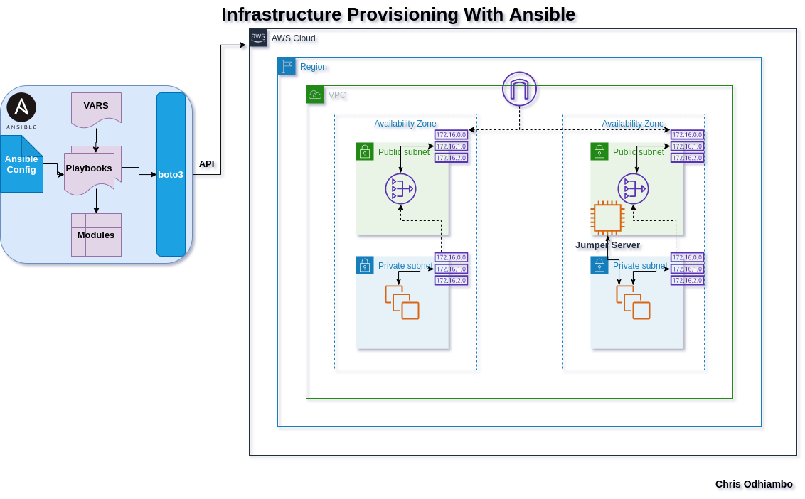

# Infrastructure Setup with Ansible

This project demonstrates the use of **Ansible** to automate the provisioning of infrastructure in AWS. The setup includes creating a bastion host with the necessary security groups, key pairs, and instance configurations.

## Key Features

- **Bastion Host**: A secure entry point to the private network.
- **Ansible Automation**: Automates the creation of AWS resources like EC2 instances, security groups, and key pairs.
- **Dynamic Variables**: Uses variable files for flexibility and reusability.

## Project Structure

- **bastion-instance.yml**: An Ansible playbook to provision the bastion host.
- **vars/bastion_setup**: Contains variables specific to the bastion host setup.
- **vars/output_vars**: Contains output variables from other infrastructure components.

## Steps to Deploy

### 1. Prerequisites
- Ensure you have the following installed:
  - **Ansible**: For running the playbook.
  - **AWS CLI**: For AWS authentication and configuration.
- Configure AWS credentials using `aws configure`.

### 2. Bastion Host Setup
- Run the `bastion-instance.yml` playbook to:
  - Create an EC2 key pair (`vprofile-key`) and save the private key locally.
  - Create a security group (`Bastion-host-sg`) to allow SSH access (port 22) from your IP.
  - Launch a t2.micro EC2 instance as the bastion host in the specified VPC and public subnet.

### 3. Variables
- Update the following variables in the `vars/bastion_setup` and `vars/output_vars` files:
  - `region`: AWS region where the resources will be created.
  - `vpcid`: VPC ID for the bastion host.
  - `pubsub1id`: Subnet ID for the public subnet.
  - `MYIP`: Your public IP address (CIDR format).
  - `bastion_ami`: AMI ID for the bastion host.

### 4. Accessing the Bastion Host
- Use the generated private key (`bastion-key.pem`) to SSH into the bastion host:
  ```bash
  ssh -i bastion-key.pem ec2-user@<bastion-host-public-ip>
  ```

## Technologies Used

- **Ansible**: For infrastructure automation.
- **AWS EC2**: For hosting the bastion instance.
- **AWS VPC**: For network isolation and security.

## Notes

- Ensure the `bastion-key.pem` file is kept secure and has the correct permissions (`chmod 600 bastion-key.pem`).
- The playbook uses dynamic variables for flexibility; ensure all required variables are correctly defined before running the playbook.

## Contact

For any questions or issues, please contact the VisualPath team at:
- **Email**: chrispineouda@gmail.com
- **Phone**: +254114173968



